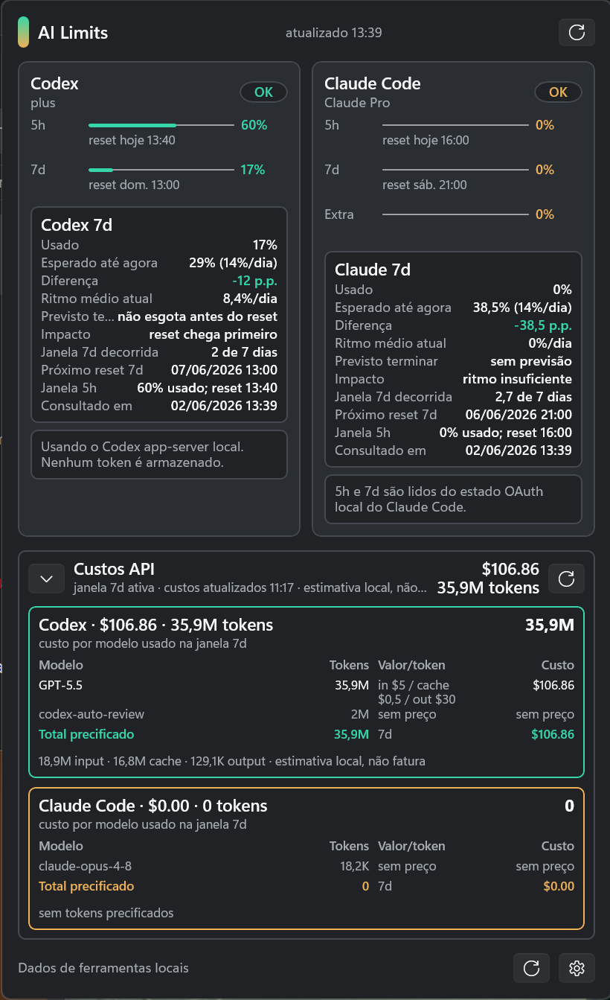
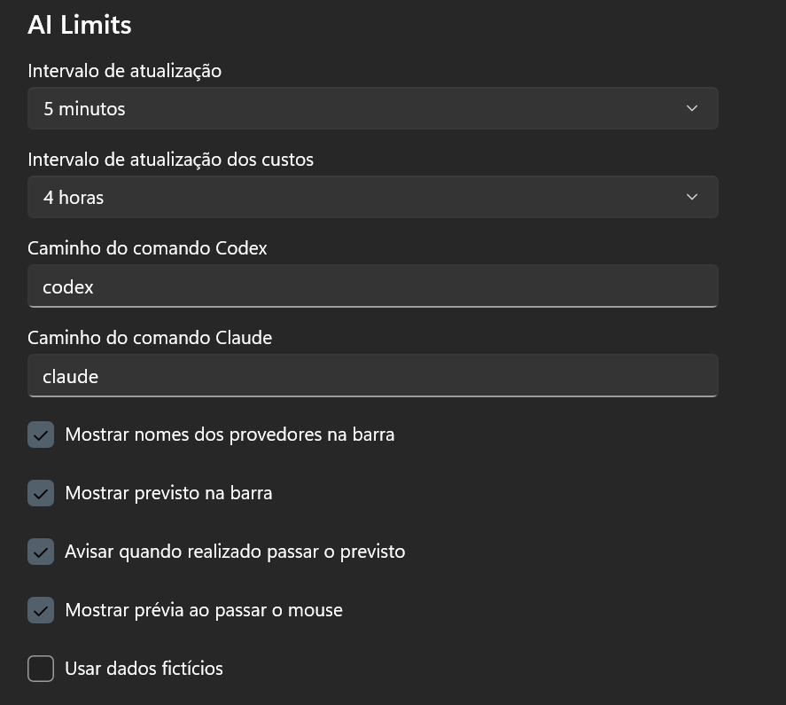

# WindowSill AI Limits

WindowSill AI Limits is a [WindowSill](https://getwindowsill.app) extension that shows local
usage for **Codex (OpenAI)** and **Claude Code (Anthropic)** directly in the sill bar.
It tracks 5h and 7d windows, reset times, usage pacing, and API-equivalent token cost.

The extension reads usage from the local tools you already have installed and authenticated.
It does not store tokens and does not send credentials to third parties.

## Screenshots






## Features

- Compact sill bar with 5h and 7d usage for Codex and Claude Code.
- Popup with provider status, usage bars, reset times, weekly pacing, and forecast impact.
- API-equivalent cost view for token usage read from local tool data.
- Hover preview with a concise provider summary.
- Background refresh plus manual refresh.
- Responsive layout for different sill orientations and sizes.

Interactive mockups are available under [`docs/mockups/`](docs/mockups/).

## Requirements

- Windows 10/11 with **WindowSill** installed.
- **Codex CLI** installed and authenticated. The extension queries the local `codex app-server`.
- **Claude Code** installed and authenticated. The extension reads the local Claude Code OAuth state.
- .NET SDK 10 to build from source.

## Install WindowSill

For individual users, install WindowSill from the Microsoft Store. The official installation
guide also supports installing it with WinGet:

```pwsh
winget install --id 9PG6CJPXTPZ0 --source msstore
```

After installation, launch WindowSill once from the Start menu and complete any first-run setup.
For enterprise or managed deployments, use the standalone installer described in the
[WindowSill installation guide](https://getwindowsill.app/doc/articles/administration-and-setup/installation.html).

## Install AI Limits

1. Download or build `WindowSillAiLimits.<version>.wsext`.
2. Double-click the `.wsext` file to install it in WindowSill.
3. Restart or reload WindowSill. The `AI Limits` sill is activated by default.

## Settings

Open the `AI Limits` sill settings to configure:

- Refresh interval for usage data.
- Refresh interval for cost data.
- Codex and Claude command paths, defaulting to `codex` and `claude`.
- Provider names and forecast text in the compact bar.
- Warning when usage exceeds expected pacing.
- Hover preview.
- Mock data for local UI checks and screenshots.

## Privacy And Security

- Claude OAuth access tokens are read only in memory for the local usage request.
- If Claude Code has a valid refresh token, the extension may refresh the existing Claude Code
  credentials file. It does not create its own token store.
- Cache, settings, diagnostics, UI, and packaged artifacts do not store access tokens, refresh
  tokens, authorization headers, or raw OAuth payloads.
- Local usage snapshots contain normalized provider/window values and cost summaries only.
- Diagnostic messages are sanitized before being shown in the UI.
- Command paths are resolved from `PATH`; use trusted executables.

## Build

```pwsh
dotnet build .\WindowSillAiLimits.slnx -c Release
.\scripts\validate-package.ps1
dotnet run --project .\tests\WindowSillAiLimits.Tests\WindowSillAiLimits.Tests.csproj -c Release
```

Optional live provider smoke checks:

```pwsh
dotnet run --project .\tests\WindowSillAiLimits.Tests\WindowSillAiLimits.Tests.csproj -c Release -- --live-codex
dotnet run --project .\tests\WindowSillAiLimits.Tests\WindowSillAiLimits.Tests.csproj -c Release -- --live-claude
```

Release builds generate a NuGet package and a synchronized `.wsext` file under `artifacts/`.

## Architecture

- `AiLimitsSill` implements `ISillActivatedByDefault` and `ISillSingleView`.
- `UsageRefreshService` coordinates periodic refresh, non-overlapping callbacks, provider
  isolation, cooldown, and local snapshot cache.
- Provider probes collect Codex usage via local Codex app-server data and Claude usage via local
  Claude Code OAuth state.
- Cost estimation reads local tool token usage and maps it through a small model price catalog.
- UI state is projected through `AiLimitsViewModel` into compact bar, hover preview, popup, and
  settings views.

## Documentation

- [Install dependencies](docs/INSTALL.md)
- [Data sources](docs/DATA_SOURCES.md)
- [WindowSill extension research](docs/WINDOWSILL_EXTENSION_RESEARCH.md)

## License

MIT. See [`LICENSE`](LICENSE).
